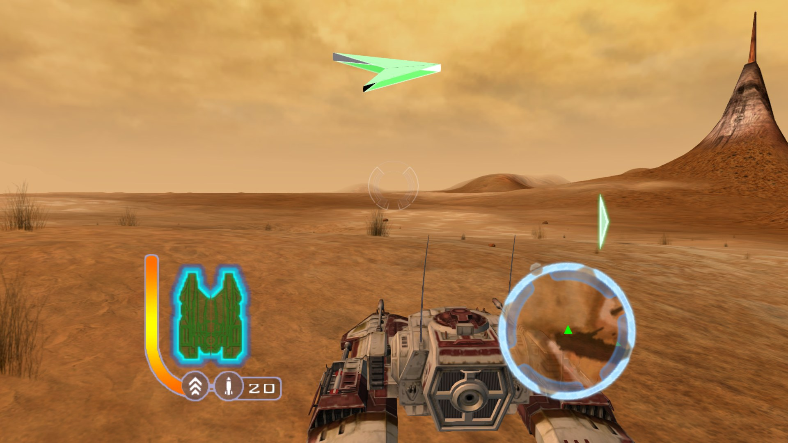
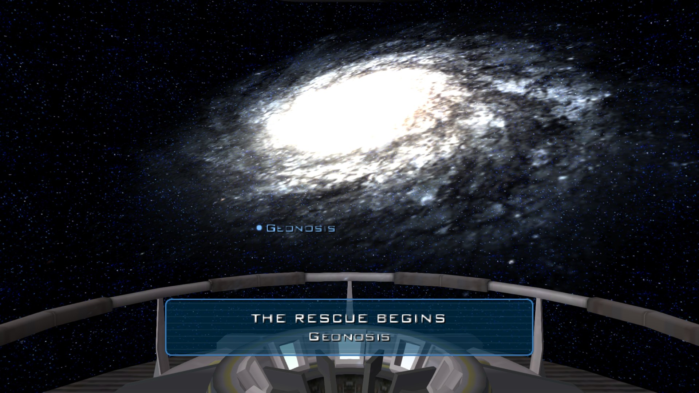
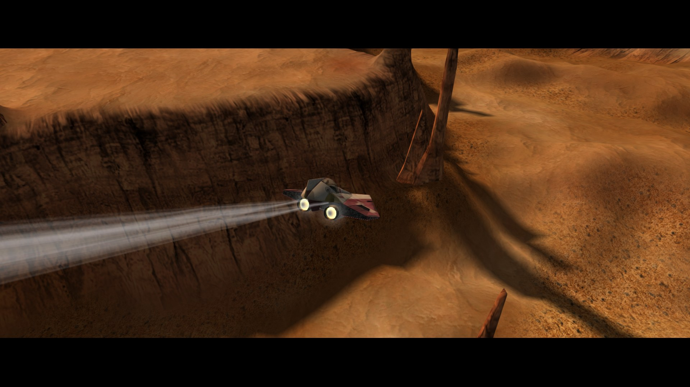
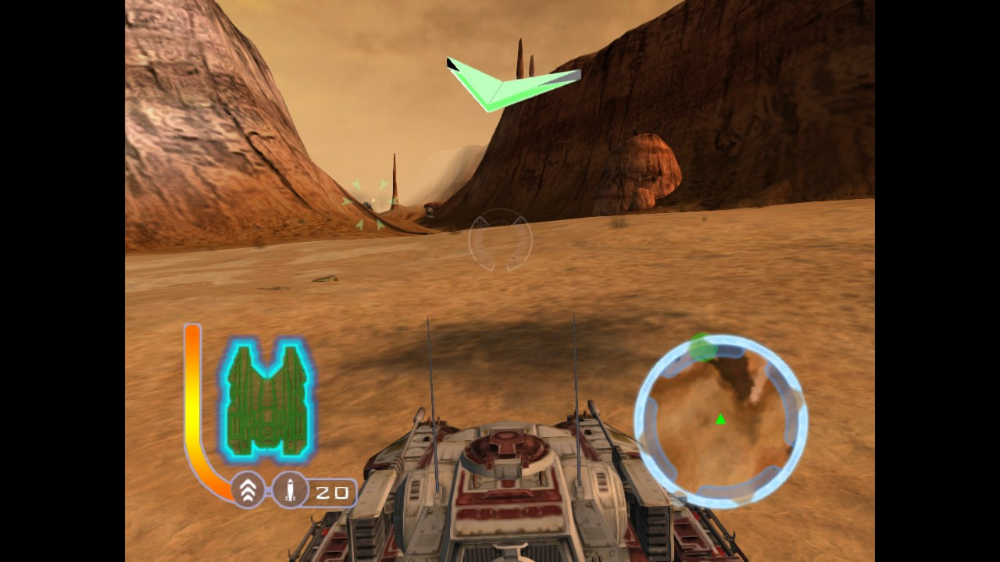
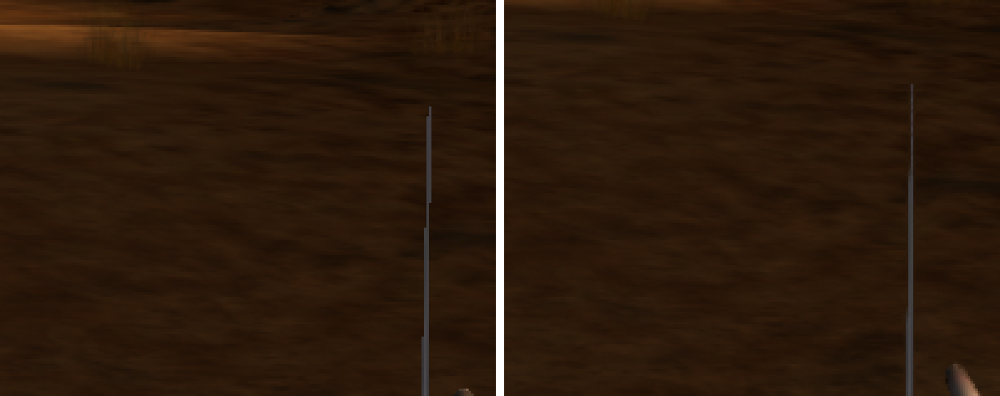

# Star Wars: The Clone Wars — PC

A native Windows port of the 2002 Xbox game *Star Wars: The Clone Wars*
(LucasArts / Pandemic Studios), built by **static recompilation**: the game's
x86 code is translated into C and compiled into a Windows executable. There is
no emulator. Graphics go through Microsoft's real Direct3D 8, sound through the
Windows audio mixer, and controllers through XInput.



**This repository contains no game code or data.** You need your own copy of
the original Xbox disc. The build regenerates the translated code from your
`default.xbe`; nothing derived from the game is distributed here.

## Features

- Any resolution, windowed or borderless full screen
- True widescreen: the 3D view is widened by the game's own camera, so more of
  the world is visible and nothing is stretched. Menus, HUD and 2D art keep
  their original 4:3 layout, pillarboxed.
- FXAA anti-aliasing
- Locked 60 fps, matching the original's frame pacing
- Xbox controller support, plus keyboard

| | |
|---|---|
|  |  |
| Galaxy map, 1920x1080 | In-engine cutscene, 1920x1080 |
|  |  |
| `Widescreen=0`: the original 4:3 picture | FXAA off (left) and on (right), 3x zoom |

## Settings

`CloneWars.ini` is created next to the executable on first run:

```ini
[Video]
Width=1280        ; 0 = monitor resolution
Height=720
Fullscreen=0      ; 1 = borderless window covering the monitor
Widescreen=1      ; 0 = original 4:3 picture with side bars
FXAA=1
```

Widescreen is tested at 16:9. Ultrawide (21:9 and wider) is experimental
and incomplete. At any wide setting, an enemy in the extra side area (outside
the original 4:3 view) gets an off-screen arrow instead of a target marker.

Keyboard: Enter = Start, Esc = Back, arrows = D-pad, WASD = left stick,
Z/X/C/V = A/B/X/Y, Q/E = triggers.

Saves are stored in `%LOCALAPPDATA%\CloneWarsRecomp`.

## Status

Single player is playable. Known gaps:

- Pre-baked terrain sun shadows are not drawn yet.
- A few pixel shaders fall back to a simplified version.
- Multiplayer / split-screen is not supported.

## Building

### Requirements

- Windows 10/11, Visual Studio 2022 (Desktop C++ workload), CMake 3.20+
- Python 3.10+ with `capstone` (`pip install capstone`)
- **DirectX 8.1 SDK** headers and `d3d8.lib`, for the 32-bit renderer
  (default location `C:\Program Files (x86)\DXSDK`, override with
  `-DDXSDK8_DIR=...`)
- Your own dump of the game disc (NTSC-U retail, XBE built 2003-04-04)

### 1. The recompiler toolkit

This project is built on [xboxrecomp](https://github.com/sp00nznet/xboxrecomp)
(MIT). It needs a handful of fixes that live in `patches/xboxrecomp.patch`.
Clone the toolkit next to this repository and apply the patch:

```bash
git clone https://github.com/sp00nznet/xboxrecomp.git
cd xboxrecomp
git checkout 6f55eaa
git apply ../StarWars-CloneWars-PC/patches/xboxrecomp.patch
```

### 2. Generate the translated code from your XBE

Copy your `default.xbe` to `game/default.xbe`, then from the `xboxrecomp`
folder:

```bash
python -m tools.xbe_parser   ../StarWars-CloneWars-PC/game/default.xbe --json ../StarWars-CloneWars-PC/game/analysis.json
python -m tools.disasm       ../StarWars-CloneWars-PC/game/default.xbe -v --force --seed-functions ../StarWars-CloneWars-PC/tools/icall_seed_functions.json
python -m tools.func_id      ../StarWars-CloneWars-PC/game/default.xbe -v
python -m tools.abi_analysis ../StarWars-CloneWars-PC/game/default.xbe -v
python -m tools.recomp       ../StarWars-CloneWars-PC/game/default.xbe --all --split 1000 --gen-dir ../StarWars-CloneWars-PC/src/recomp/gen --game-name "Star Wars: The Clone Wars" --exclude-manual ../StarWars-CloneWars-PC/src/recomp_manual.c
```

Then, from this repository, mark the functions replaced by hand-written code:

```bash
python tools/apply_manual.py
```

### 3. Build

The renderer uses the 32-bit `d3d8.dll`, so build for Win32:

```bash
cmake -S . -B build32 -A Win32
cmake --build build32 --config Release
```

The build copies `CloneWars32.exe` two folders up (`../..`). Arrange the
folders so that lands in your game directory, the folder holding
`default.xbe`, `data.zwp` and the `Data`, `Movies`, `Bins` and `Addon`
folders, or copy the `.exe` and `.pdb` there yourself. Run it from there.

## Source layout

| Path | What it is |
|---|---|
| `src/main.c` | Entry point, directory and save setup |
| `src/hle_d3d8.c`, `hle_d3d8_vsh.inc`, `hle_d3d8_psh.inc` | Direct3D 8 renderer: Xbox vertex/pixel shader translation, widescreen, resolution scaling, FXAA |
| `src/hle_dsound.c`, `hle_dsound_mix.inc` | DirectSound replacement and audio mixer |
| `src/hle_input.c` | Controller and keyboard input |
| `src/recomp_manual.c` | Hand-written replacements for individual game functions |
| `tools/` | Seed lists for the disassembler and helper scripts |
| `patches/xboxrecomp.patch` | Changes to the xboxrecomp toolkit |

## Credits

- [xboxrecomp](https://github.com/sp00nznet/xboxrecomp) by sp00nz (MIT);
  the patch in `patches/` modifies files from it and is under the same licence.
- Star Wars: The Clone Wars is © Lucasfilm Ltd. This is an unofficial fan
  project and is not affiliated with or endorsed by Lucasfilm, Disney, or
  Electronic Arts.
